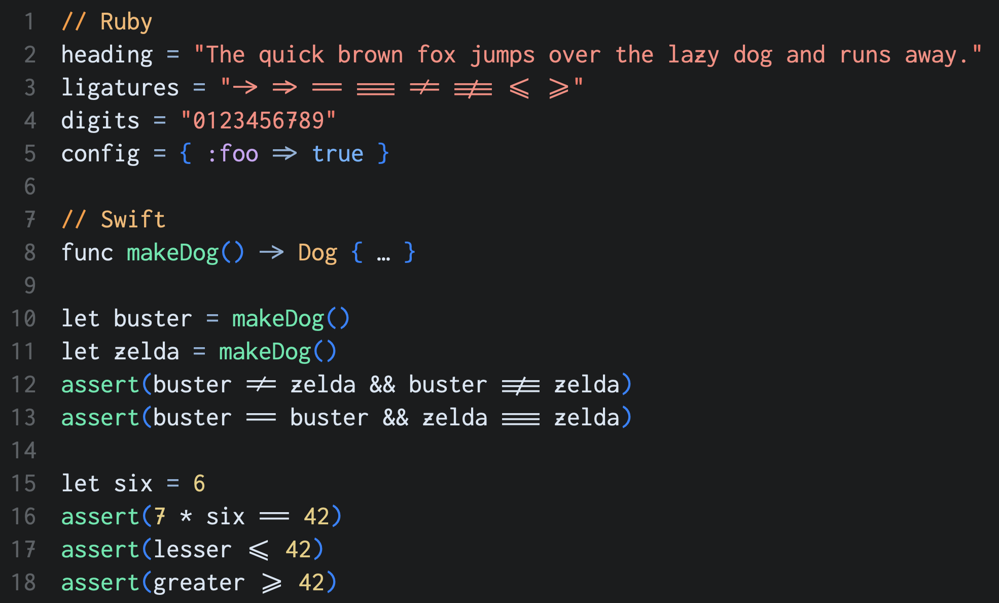

# Zigconsolata

Zigconsolata is a variant of the Inconsolata Regular font. It adds horizontal strokes to Z's and 7's, and includes a minimal set of custom coding-related ligatures that are enabled by default.

The complete Inconsolata typeface is available at [googlefonts/Inconsolata](https://github.com/googlefonts/Inconsolata). Inconsolata was created by [Raph Levien](https://github.com/raphlinus) and is licensed under the [SIL Open Font License](LICENSE.md).

## Code samples

